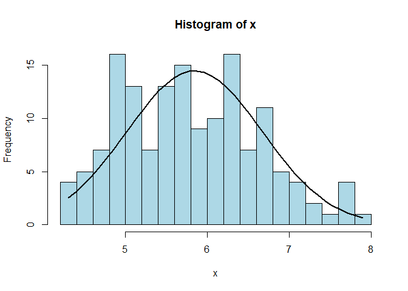

<!-- README.md is generated from README.Rmd. Please edit that file -->

# niceFunction

<!-- badges: start -->

<!-- badges: end -->

The goal of niceFunction is retain all random function that I found all
over the books, forums, etc

## Installation

You can install the development version from
[GitHub](https://github.com/) with:

``` r
# install.packages("devtools")
devtools::install_github("tengku-hanis/niceFunction")
```

## Example

This is a summary example which shows the use of each function:

``` r
library(niceFunction)

## Histogram with normal curve
histWithCurve(iris$Sepal.Length)
```



``` r

## Regression diagnostic screening
mod <- lm(Sepal.Length ~ Species + Sepal.Width, data = iris)
regDiag(mod)
#> $outlier
#> $outlier$leverage
#> leverage
#> FALSE 
#>   150 
#> 
#> $outlier$SDR
#> SDR
#> FALSE  TRUE 
#>   148     2 
#> 
#> 
#> $influence
#> $influence$DFFits
#> DFFits
#> FALSE 
#>   150 
#> 
#> $influence$DFBetas
#> DFBetas
#> FALSE 
#>   600 
#> 
#> $influence$cook.d
#> cook.d
#> FALSE 
#>   150
```
