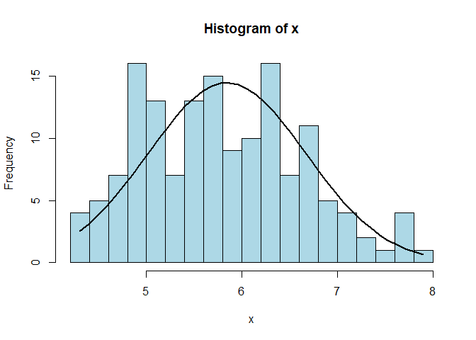
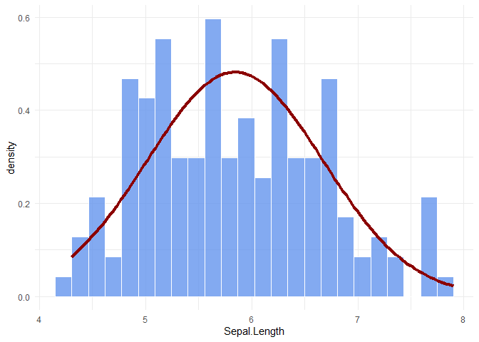

<!-- README.md is generated from README.Rmd. Please edit that file -->

# niceFunction

<!-- badges: start -->
<!-- badges: end -->

The goal of niceFunction is to retain all random function that I found
all over the books, forums, etc

## Installation

You can install the the development version from
[GitHub](https://github.com/) with:

``` r
# install.packages("devtools")
devtools::install_github("tengku-hanis/niceFunction")
```

## Example

This is a summary example which shows the use of each function. As of
now, this package only have 4 functions:

1.  histWithCurve
2.  histCurve
3.  regDiag
4.  read_excel_allsheets
5.  changeType

``` r
library(niceFunction)
```

histWithCurve give a histogram with a normal density curve

``` r
histWithCurve(iris$Sepal.Length)
```



histCurve give a ggplot2 histogram with a normal desnity curve

``` r
histCurve(iris, Sepal.Length)
```



regDiag is used for screening of outliers and influential cases

``` r
mod <- lm(Sepal.Length ~ Species + Sepal.Width, data = iris)
regDiag(mod)
#> $outlier
#> $outlier$leverage
#> leverage
#> FALSE 
#>   150 
#> 
#> $outlier$SDR
#> SDR
#> FALSE  TRUE 
#>   148     2 
#> 
#> 
#> $influence
#> $influence$DFFits
#> DFFits
#> FALSE 
#>   150 
#> 
#> $influence$DFBetas
#> DFBetas
#> FALSE 
#>   600 
#> 
#> $influence$cook.d
#> cook.d
#> FALSE 
#>   150
```

read_excel_allsheets read all excel sheets or several excel sheets

``` r
## Read all excel sheets (not run)
# read_excel_allsheets("datasets")

## Read several excel sheets (not run)
# read_excel_allsheets("datasets", pages = 2:5)
```

changeType change the variable type across list of data frames

``` r
# Make a list
iris_list <- list(iris1 = iris, iris2 = iris)

# Change one variable type
iris_list <- lapply(iris_list, changeType, Var = "Sepal.Width", funct = "as.character")

# Change 2 variables type
iris_list <- lapply(iris_list, changeType, Var = c("Sepal.Length", "Species"), funct = "as.character")
```
