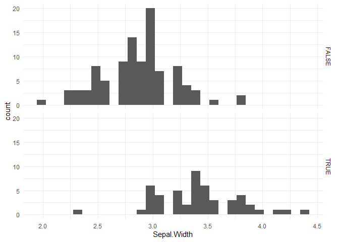

<!-- README.md is generated from README.Rmd. Please edit that file -->

# niceFunction

<!-- badges: start -->

[](https://github.com/tengku-hanis/niceFunction/actions)
<!-- badges: end -->

The goal of niceFunction is to retain all random function that I found
all over the books, forums, etc

## Installation

You can install the the development version from
[GitHub](https://github.com/) with:

``` r
# install.packages("devtools")
devtools::install_github("tengku-hanis/niceFunction")
```

## Example

This is a summary example which shows the use of each function. As of
now, this package only have 6 functions:

1.  histWithCurve
2.  histCurve
3.  histNA_byVar
4.  regDiag
5.  read_excel_allsheets
6.  changeType

``` r
library(niceFunction)
library(dplyr)
#> 
#> Attaching package: 'dplyr'
#> The following objects are masked from 'package:stats':
#> 
#>     filter, lag
#> The following objects are masked from 'package:base':
#> 
#>     intersect, setdiff, setequal, union
```

histWithCurve give a histogram with a normal density curve

``` r
histWithCurve(iris$Sepal.Length)
```


histCurve give a ggplot2 histogram with a normal density curve

``` r
histCurve(iris, Sepal.Length)
```


histNA_byVar assess the distribution of NAs of certain variable is
affected by another variable

``` r
dat <- iris
dat[dat$Species == "setosa", "Sepal.Length"] <- NA
histNA_byVar(dat, Sepal.Length, Sepal.Width)
```



``` r
#indicate right-tailed missingness
```

regDiag is used for screening of outliers and influential cases

``` r
# Create some outlier observations
iris[151, ] <- c(9, 9, 9, 9, "virginica")
iris <- iris %>% 
  mutate(across(c(Sepal.Length:Petal.Width), as.numeric))

mod <- lm(Sepal.Length ~ Species + Sepal.Width, data = iris)
regDiag(mod)
#> 
#> 
#> leverage    Freq
#> ---------  -----
#> FALSE        150
#> TRUE           1
#> 
#> SDR      Freq
#> ------  -----
#> FALSE     148
#> TRUE        3
#> 
#> DFFits    Freq
#> -------  -----
#> FALSE      151
#> 
#> DFBetas    Freq
#> --------  -----
#> FALSE       603
#> TRUE          1
#> 
#> cook.d    Freq
#> -------  -----
#> FALSE      150
#> TRUE         1
```

True indicate the presence of outliers and influential cases according
that metrics and vice-versa

read_excel_allsheets read all excel sheets or several excel sheets

``` r
## Read all excel sheets (not run)
# read_excel_allsheets("datasets")

## Read several excel sheets (not run)
# read_excel_allsheets("datasets", pages = 2:5)
```

changeType change the variable type across list of data frames

``` r
# Make a list
iris_list <- list(iris1 = iris, iris2 = iris)

# Change one variable type
iris_list <- lapply(iris_list, changeType, Var = "Sepal.Width", funct = "as.character")

# Change 2 variables type
iris_list <- lapply(iris_list, changeType, Var = c("Sepal.Length", "Species"), funct = "as.character")
```
